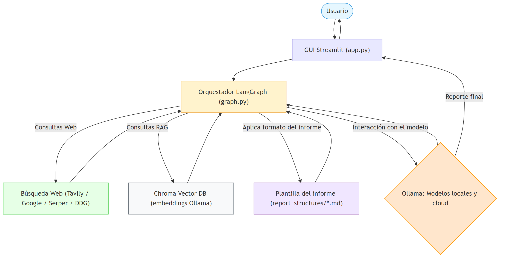

# 🧠 Ollama WebRAG Researcher 🔍

Un investigador que no bosteza. Un asistente que no se dispersa.  
**Ollama WebRAG Researcher** es una plataforma de trabajo para investigar a fondo un tema, **combinando documentos propios (RAG)** y **búsqueda web en tiempo real**, orquestado por **LangGraph** y redactado por **modelos Ollama** — locales o en la nube. Todo desde una **GUI en Streamlit** pensada para trabajar, citar y publicar.

---

## ¿Qué es lo que hace y qué no?

**Lo que sí hace**
- **Investiga** a partir de tus instrucciones, **genera consultas** y **recupera evidencia** de:
  - **Tu base local** (RAG con ChromaDB).
  - **La web** mediante proveedores configurables.
- **Redacta informes** con **plantillas**, citando fragmentos internos `[S#]` y fuentes web `[W#]`.
- **Funciona con cualquier modelo soportado por Ollama** (local o cloud).
- Permite **modos de búsqueda**: **Solo Web**, **Solo RAG** o **Híbrido**.

**Lo que no hace**
- No es un **chatbot generalista**: su foco es **investigación estructurada** con evidencia.
- No realiza **OCR**: si tu PDF es escaneado/imagen, **haz OCR antes**.
- No inventa fuentes: si no hay evidencia, **lo dice**.
- No sube tus documentos: la **base vectorial es local**.

---

## Características principales

- **Dedicado a Ollama**  
  Trabaja con **todos los modelos Ollama** que tengas disponibles: locales o cloud (`deepseek-r1:8b`, `qwen3:8b`, `gpt-oss:20b-cloud`, `ollama run deepseek-v3.1:671b-cloud`, etc.).

- **RAG (explicación breve)**  
  *Retrieval-Augmented Generation* = antes de escribir, el modelo **recupera fragmentos** de tus documentos (en ChromaDB) y **redacta con esa evidencia**.  
  Ventaja: **respuestas fundamentadas**, citas claras y menos alucinaciones.

- **Búsqueda web flexible**  
  Proveedores soportados:
  - **Tavily**
  - **Google CSE** (requiere `GOOGLE_API_KEY` + `GOOGLE_CSE_ID`)
  - **Serper**
  - **DuckDuckGo** (no requiere clave)

- **Plantillas de informe**  
  En `report_structures/` encontrarás formatos listos (resumen, artículo divulgativo, investigación periodística, económico, etc.).  
  Resultado: entregas **coherentes**, **estructuradas** y **citadas**.

- **Base local, desechable**  
  Al subir **`.txt`, `.md`, `.csv`, `.pdf`** (con texto extraíble), se indexan en `./database/` (Chroma).  
  ¿Terminaste? **Borra la carpeta** y listo; se recrea cuando la necesites.

---

## Cómo funciona (panorama rápido)

1. **Tu instrucción** → GUI (Streamlit).
2. **LangGraph** orquesta:
   - Genera **consultas** de investigación.
   - Lanza **búsqueda web** (si procede).
   - Recupera **fragmentos RAG** de Chroma.
   - Ensambla el **prompt final** con **plantilla** y **modo**.
3. **Ollama** redacta la **respuesta final** citando [S#]/[W#].
4. La GUI muestra **razonamiento (si aplica)** y **respuesta formateada**.

> **PDFs**: si es un PDF de **imágenes/scan**, realiza **OCR previo** (esta app no hace OCR).

<!-- Diagrama de Flujo (PNG) -->
<p align="center">
  
</p>
---

## La GUI, en dos palabras

- **Sidebar**: eliges **modo** (Solo Web / Solo RAG / Híbrido), **proveedor**, **plantilla**, **modelo Ollama**, **nº de búsquedas**, y **subes documentos**.
- **Área central**:  
  - Vista por pasos (**consultas**, **web**, **RAG**, **razonamiento**, **respuesta**).  
  - Botón para **copiar** la respuesta final.

<!-- Demo GUI -->
<p align="center">
  
</p>
---

## Requisitos previos

- **Python** ≥ **3.13**
- **Ollama** → https://ollama.com/download
- **Modelos Ollama** (elige local o cloud):
  ```bash
  # Ejemplos locales (si tu setup lo soporta)
  ollama run deepseek-r1:8b
  ollama run qwen3:8b

  # Ejemplos cloud (no requiere requisitos de hardware, aunque está limitado a las políticas de uso de Ollama)
  ollama run gpt-oss:20b-cloud
  ollama run deepseek-v3.1
  ```

- **Modelo de embeddings (para RAG)**  
  Por defecto: **`mxbai-embed-large:latest`** (preciso):
  ```bash
  ollama pull mxbai-embed-large
  ```
  Alternativa ligera: **`nomic-embed-text:latest`**
  ```bash
  ollama pull nomic-embed-text
  ```
  Cambia la constante `OLLAMA_EMBED_MODEL` en `src/assistant/vector_db.py` si usas otro.

---

## Claves API para buscadores

Añádelas a tu `.env`. Enlaces directos:

```ini
# Tavily API (SearchTool) → https://app.tavily.com/home
TAVILY_API_KEY=" "

# Google API Key → https://console.cloud.google.com/apis/credentials
GOOGLE_API_KEY=" "

# Google Programmable Search Engine (CSE) ID → https://programmablesearchengine.google.com/
GOOGLE_CSE_ID=" "

# Serper API Key → https://serper.dev/api-keys
SERPER_API_KEY=" "
```

> Sin claves, usa **DuckDuckGo** (Importante: selecciónalo en la sidebar antes de consultar).

---

## Instalación (Windows PowerShell)

```powershell
# 1) Clonar el repositorio
git clone https://github.com/lgfraga/Ollama_WebRAG_Researcher.git
cd Ollama_WebRAG_Researcher

# 2) Entorno virtual
python -m venv .venv
.venv\Scripts\Activate.ps1

# 3) Variables de entorno
cp .env.example .env   # (o Copy-Item .env.example .env)
# Edita .env y añade tus claves (o deja vacío si usarás DuckDuckGo)

# 4) Dependencias (recomendado)
pip install -r requirements-lock.txt

# 5) Ejecutar la app
streamlit run app.py
```

> **Recomendado**: `requirements-lock.txt` para replicar exactamente el entorno (Python 3.13).  
> Si usas otra versión de Python, prueba con `requirements.txt` (puede requerir ajustar versiones de algunas librerías).

---

## Uso de documentos (RAG)

- Tipos aceptados: **`.txt`, `.md`, `.csv`, `.pdf`** (con texto extraíble).  
- PDFs escaneados: **OCR previo**.
- Tras **Procesar archivos** (sidebar):
  - Se indexan en **Chroma (`./database/`)** con embeddings de Ollama.
- ¿Limpiar índice? **Borra la carpeta `database/`** sin miedo; se recrea sola.

**Solo RAG**  
- Responde **solo** con documentos locales. Ideal para **informes privados o corpus cerrado**.

**Híbrido (RAG + Web)**  
- Mezcla **fragmentos internos** y **fuentes externas**, priorizando RAG y **complementando** con web.

---

## Plantillas de informe

- Carpeta `report_structures/` con plantillas listas (resumen, divulgación, periodística, económica, etc.).  
- Sirven para mantener **estructura**, **tono** y **citas**.  
- Puedes **añadir** las tuyas (la GUI las detecta automáticamente).

---

## Consejos y solución de problemas

- **“No se han encontrado modelos en Ollama”**  
  Verifica que **Ollama** está en marcha y que hiciste **pull** del modelo:
  ```bash
  ollama serve
  ollama pull qwen3:8b
  ```

- **Errores al buscar en la web**  
  - Revisa el `.env`.  
  - O selecciona **DuckDuckGo** si no tienes APIs.

- **PDF sin texto**  
  Haz **OCR** antes (la app no hace OCR).

- **RAG sin resultados**  
  - Asegura que **procesaste archivos** (sidebar).  
  - Revisa calidad y extensión de tus documentos.

---

## Estructura del proyecto

```
.
├─ app.py                      # GUI (Streamlit)
├─ ollama_researcher.py        # CLI simple (opcional)
├─ report_structures/          # Plantillas de informe
	├─ articulo_cientifico.md
	├─ articulo_cultural.md
	├─ articulo_divulgativo.md
	├─ articulo_documental.md
	├─ articulo_topoastronomia.md
	├─ curiosidades_leyendas.md
	├─ historia_leyendas.md
	├─ investigacion_cualitativa.md
	├─ investigacion_cuantitativa.md
	├─ investigacion_mixta.md
	├─ investigacion_periodistica.md
	├─ noticias_extraordinarias.md
	├─ periodistica_documental.md
	├─ reporte_economico.md
	├─ reporte_financiero.md
	├─ resumen_conciso.md
	├─ resumen_RAG-WEB.md
	├─ tradicion_popular.md
├─ src/assistant/
│   ├─ graph.py                # Orquestación LangGraph
│   ├─ utils.py                # Búsqueda web, Ollama, carga docs
│   ├─ vector_db.py            # Chroma + embeddings (Ollama)
│   ├─ prompts.py              # Prompts especializados
│   ├─ configuration.py        # Config base
│   └─ state.py                # Tipos de estado
└─ .streamlit/config.toml      # Tema UI
```

---

## Filosofía

Esta herramienta nace de una intuición sencilla:  
**Investigar bien es decidir bien**.  
La IA no sustituye criterio, pero **acelera el trabajo duro**: escarba, contrasta, estructura, cita. Tú conservas el timón.

---

## Licencia y aportes

- ¿Ideas para proveedores o integraciones? ¡Bienvenidas!
	
---

Abre `http://localhost:8501`, elige tu plantilla, sube tus documentos, decide el modo… y **que hable la evidencia**.

## Licencia

El contenido de este repositorio está bajo la licencia **Creative Commons Atribución-NoComercial-SinDerivadas 3.0 (CC BY-NC-ND 3.0)**.  
Consulta el archivo [LICENSE](LICENSE) y los siguientes enlaces oficiales:

- **Resumen (ES):** https://creativecommons.org/licenses/by-nc/3.0/es/  
- **Código legal (ES):** https://creativecommons.org/licenses/by-nc/3.0/es/legalcode.es  
- **Código legal (EN):** https://creativecommons.org/licenses/by-nc-nd/3.0/legalcode
